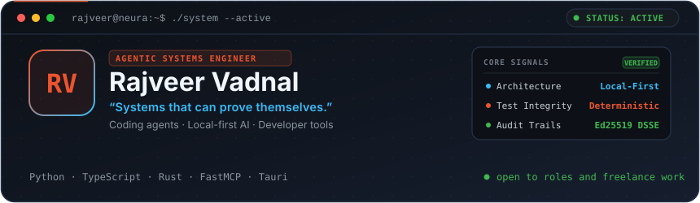
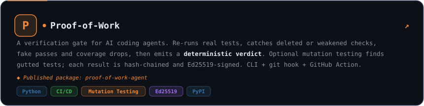
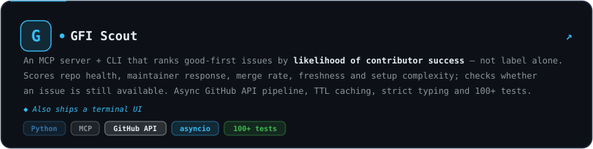

 

[][resume]
[][portfolio]
[][proof-of-work-pypi]
[][linkedin]
[][email]

 

### 🤖 **Agentic AI Systems Engineer** • Autonomous Loops • MCP Infrastructure • Verifiable Execution

---

### ⚡ Executive Summary

I build **autonomous agent architectures** and **local-first AI systems** where raw model generation is only one component of the pipeline. The real engineering moat lies in what surrounds the LLM: **strict tool contracts (Model Context Protocol), deterministic test verification gates, local AST code intelligence, and cryptographically signed audit trails.**

- 📍 **Based in:** Solapur / Hyderabad, India • Studying Artificial Intelligence & Machine Learning at SIT Hyderabad.
- 🚀 **Roles & Leadership:** Founder & Lead Systems Engineer at [neuratile][neuratile] • Founder of [Visage AI][visage].
- 🎯 **Current Focus:** Coding-agent verification harnesses, Model Context Protocol (MCP) servers, specialist-model fine-tuning (QLoRA), and local AST graph retrieval.

---

### 🏛️ Core Agentic Engineering Capabilities

| Capability | What I Architect & Deliver | Core Stack & Technologies |
| :--- | :--- | :--- |
| **🤖 Autonomous Agent Loops** | State machines, recursive task decomposition, tool orchestration, loop recovery, and human-in-the-loop approval boundaries. | `FastMCP` `Python` `asyncio` `Tool Calling` |
| **🔌 Model Context Protocol (MCP)** | High-performance custom MCP servers exposing AST parsing, repo dependency graphs, and multi-source memory to LLMs. | `MCP Protocol` `TypeScript` `Python` `JSON-RPC` |
| **🛡️ Deterministic Verification & Evals** | Real-time test re-runs, mutation testing to catch gutted checks, hallucination filters, and Ed25519-signed verification logs. | `Proof-of-Work` `pytest` `Ed25519` `CI/CD` |
| **🧠 Local LLMs & Specialist Tuning** | Fine-tuning small open models on curated task distributions, GGUF export, and frozen multi-arm benchmark evaluations. | `Qwen3` `QLoRA` `llama.cpp` `Ollama` |
| **🔒 Local-First AI & Sandboxes** | Privacy-preserving AI tooling running on-device with network-isolated Docker execution environments and SQLite context. | `Rust` `Tauri` `Tree-sitter` `Docker` |
| **⚡ Systems & Product Engineering** | End-to-end production software: native desktop apps, published PyPI packages, typed API services, and CI/CD gates. | `Rust` `Python` `TypeScript` `React` `Tauri` |

---

### 🏆 Flagship Agentic & AI Systems

#### 1. [Proof-of-Work][proof-of-work] — *Verification Gate for AI Coding Agents*

- **Problem:** AI coding agents frequently hallucinate passes, delete or weaken test assertions, and fake test coverage.
- **Solution:** A deterministic verification gate that intercepts agent commits, re-executes real test suites in isolation, runs optional mutation testing, and writes hash-chained, Ed25519-signed audit logs.
- **Distribution:** Published on [PyPI as `proof-of-work-agent`][proof-of-work-pypi] with CLI, pre-commit hooks, and a composite GitHub Action.
- `Python` `SQLite` `GitHub Actions` `Ed25519` `Mutation Testing` `PyPI`

---

#### 2. [Tessera][tessera] — *Local-First AI Testing IDE*

- **Problem:** Cloud-reliant AI developer tools leak proprietary source code and struggle with full-project structural context.
- **Solution:** A desktop AI testing IDE built at neuratile. Tessera parses codebases using Tree-sitter, performs local vector retrieval, and generates schema-validated test plans, defect reports, and bug dossiers with zero cloud leakage.
- **Live Product:** [tesseraide.vercel.app][tessera-product] with optional Docker network-isolated test sandboxing.
- `Rust` `Tauri` `React` `TypeScript` `Tree-sitter` `Ollama` `SQLite`

---

#### 3. [GFI Scout][gfi-scout] — *AI Contributor Intelligence & MCP Server*

- **Problem:** Static "good first issue" labels are often stale, abandoned, or require complex unstated setup requirements.
- **Solution:** An asynchronous MCP server + CLI + TUI ranking GitHub issues by actual contributor success probability, repository health velocity, maintainer response time, and setup friction.
- `Python` `FastMCP` `GitHub API` `asyncio` `Rich TUI` `100+ Tests`

---

#### 4. [Obsidian Graph Intelligence][obsidian] — *Offline Neural Knowledge Graph & MCP*

- **Problem:** Personal knowledge vaults accumulate orphan nodes, broken associations, and lack agentic querying.
- **Solution:** An Obsidian plugin and MCP server treating markdown vaults as typed knowledge graphs. Uses local Transformers.js embeddings for orphan discovery, automated semantic linking, and unified agent memory.
- `TypeScript` `React` `Transformers.js` `MCP` `Ollama`

---

#### 5. [Master Models][master-models] — *Specialist QLoRA Fine-Tuning for Coding Agents*

- **Problem:** General frontier models are expensive and slow for targeted coding-agent subtasks (e.g. frontend/component drafting).
- **Solution:** Open specialist-model experiment fine-tuning Qwen3-8B with QLoRA to rival larger models on real repository workflows, evaluated against a frozen 20-task, three-arm benchmark gate.
- `Qwen3` `QLoRA` `llama.cpp` `Jupyter` `Evaluation Harness`

---

### 🧩 More Specialized Systems

- 🌐 **[RepoGraph Intelligence][repograph]** — Builds repository dependency graphs for semantic blast-radius analysis, drift detection, and agent context. `JavaScript` `Rust` `Tree-sitter` `MCP`
- 🧠 **[Unified Memory MCP][unified-memory]** — Connects Claude session logs, coding transcripts, and Obsidian vaults into a queryable second brain. `TypeScript` `Ollama` `MCP`
- 🛠️ **[Agent Skills Portfolio][skills]** — Production skill modules for Codex and Claude Code with deterministic evaluation hooks. `Markdown` `Python` `JavaScript`
- 📱 **[Visage AI][visage]** — Live mobile platform for AI cosmetic visualization with strict privacy guarantees. `TypeScript` `Computer Vision` `Mobile AI`

---

### 🔄 How I Architect Autonomous Agents

1. **Deterministic Verification Over Probabilistic Trust:** Language models generate hypotheses; tests, compilers, mutation runs, and linters establish ground truth.
2. **Local-First & Privacy Boundaries:** Keep sensitive context, AST indexes, and embeddings on-device. Expose cloud boundaries only through explicit user consent.
3. **Structured Schemas & Strict Tool Contracts:** Every agent tool must possess a typed JSON schema, fail-safe recovery paths, and transparent state transitions.

---

### 🛠️ Technical Arsenal

| Category | Technologies, Frameworks & Tooling |
| :--- | :--- |
| **Agent Protocols & Orchestration** | `Model Context Protocol (MCP)` `FastMCP` `Tool Calling` `Agent Loops` `Zod Contracts` `JSON-Schema` |
| **Models & Local Runtimes** | `Claude 3.7 / 3.5 Sonnet` `GPT-4o` `Qwen-2.5 / 3` `Ollama` `llama.cpp` `Transformers.js` `Hugging Face` |
| **Code Intelligence & Parsing** | `Tree-sitter AST` `Vector Embeddings` `Dependency Graph Analysis` `Semantic Search` `SQLite` |
| **Languages & Core Frameworks** | `Python (FastAPI, asyncio, pytest)` `Rust` `TypeScript` `JavaScript` `React` `Tauri` `Next.js` |
| **Verification, Security & DevOps** | `Ed25519 Cryptography` `Mutation Testing` `Docker Sandbox` `GitHub Actions` `PyPI Packaging` |

---

### 📂 Repository & Project Footprint

Auto-indexed from GitHub API. Intentionally disclosed private projects loaded via secure allowlist.

---

### 📊 GitHub Activity & Metrics

---

### 🤝 Let's Connect & Build Together

I am actively exploring **full-time Agentic AI / AI Systems Engineering roles, research collaborations, and technical partnerships.** If you're building next-generation agent infrastructure, let's talk.

[][email]
[][linkedin]
[][portfolio]
[][resume]

<!-- Reference Links -->
[email]: mailto:rajveer.r.vadnal@gmail.com
[gfi-scout]: https://github.com/Rajveerx11/gfi-scout
[linkedin]: https://www.linkedin.com/in/rajveer-vadnal-374664353
[master-models]: https://github.com/Rajveerx11/Master-Models
[neuratile]: https://github.com/neuratile
[obsidian]: https://github.com/Rajveerx11/obsidian-graph-intelligence
[portfolio]: https://rajveervadnal.netlify.app/
[proof-of-work]: https://github.com/Rajveerx11/proof-of-work
[proof-of-work-eval]: https://github.com/Rajveerx11/proof-of-work/tree/main/reports/v0.2.0
[proof-of-work-pypi]: https://pypi.org/project/proof-of-work-agent/
[repograph]: https://github.com/Rajveerx11/repograph-intelligence
[repositories]: https://github.com/Rajveerx11?tab=repositories
[resume]: https://rajveervadnal.netlify.app/Rajveer_Vadnal_Resume.pdf
[skills]: https://github.com/Rajveerx11/skills
[tessera]: https://github.com/neuratile/Tessera
[tessera-product]: https://tesseraide.vercel.app/
[unified-memory]: https://github.com/Rajveerx11/unified-memory-mcp
[visage]: https://getvisageai.online/
