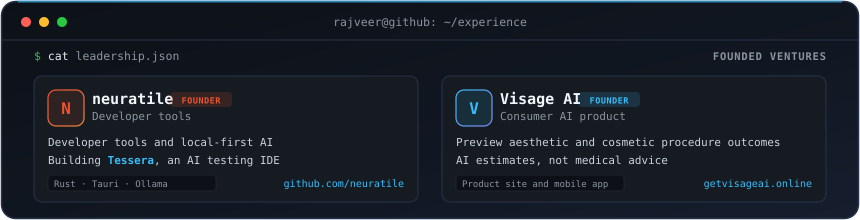

  
  
  
  
  

**Education:** Diploma in Computer Science Engineering · B.Tech in Artificial Intelligence & Machine Learning

## What I do

I build coding tools and local-first AI products. My recent work covers test verification, MCP integrations, and tools for exploring codebases. I work mainly in Python, TypeScript, and Rust.

## Where I work

[neuratile](https://github.com/neuratile) · [Visage AI](https://getvisageai.online/)

## Selected work

### ⚡ [Proof-of-Work](https://github.com/Rajveerx11/proof-of-work) · Coding-Agent Verification Gate

A CLI, Git hook, and GitHub Action that re-runs checks, catches deleted or weakened tests, and records signed verdicts.

- **Verified evidence:** Published **[60 runs across 3 agent configurations on 20 tasks](https://github.com/Rajveerx11/proof-of-work/tree/main/reports/2026-08-11-multi-agent)**: Codex 20/20, Copilot 20/20, OpenCode 17/20. One attempt per task and configuration; environment-specific comparison with zero estimated scores.
- **Tamper-evident log:** Results are hash-chained (`SHA-256`) and Ed25519-signed in SQLite; verifiable locally anytime via `proof-of-work verify-log`.
- **Mutation testing:** Integrated `mutmut` mutation testing to detect gutted test suites and coverage drops.
- **Tech stack:** `Python` `FastMCP` `SQLite` `Ed25519` `GitHub Actions` `PyPI`

---

### 🔍 [GFI Scout](https://github.com/Rajveerx11/gfi-scout) · Contributor-Focused MCP Server & CLI/TUI

Find open-source issues using repository health, maintainer responsiveness, freshness, and setup friction.

- **Verified evidence:** **4 FastMCP tools** (`find_issues`, `check_repo_health`, `check_issue_status`, `get_contribution_guide`) + shared CLI/TUI. Over 100 unit & integration tests passing in ~2s.
- **Architecture:** Async GitHub API pipeline, TTL caching, graceful rate-limit handling, and strict typing. [Watch demo](https://github.com/Rajveerx11/gfi-scout#readme) · [Architecture specs](https://github.com/Rajveerx11/gfi-scout/blob/main/docs/ARCHITECTURE.md).
- **Tech stack:** `Python` `FastMCP` `asyncio` `Rich / Textual` `GitHub API`

---

### 🛡️ [Tessera](https://github.com/neuratile/Tessera) · Local-First AI Testing IDE

A Rust/Tauri desktop app built at neuratile: retrieve code context, generate structured QA artifacts, and optionally run generated tests in network-isolated Docker containers.

- **Core contributions:** Implemented the [mutation-testing engine and scoring flow](https://github.com/neuratile/Tessera/commit/48266fa55f46fff88a966aecf88c0b437e1c5704), the [test-improvement loop](https://github.com/neuratile/Tessera/commit/6cdbc5b3b0e0432f328451f949e5ab12c9d83fac), and [persisted self-heal history](https://github.com/neuratile/Tessera/commit/9ec127a71b818296b5ac201a2bfd7e926e69a206).
- **Contract-driven generation:** AST parsing with Tree-sitter, local embeddings with Ollama, structured outputs validated by Zod schemas, optional sandboxed Docker runner.
- **Tech stack:** `Rust` `Tauri v2` `React` `Tree-sitter` `Ollama` `Docker`

---

### 🧠 [Obsidian Graph Intelligence](https://github.com/Rajveerx11/obsidian-graph-intelligence) · Offline Knowledge-Graph Analytics

Local-first knowledge-graph analysis, offline neural embeddings, and vault repair with an opt-in MCP query layer.

- **Verified evidence:** 100% offline Transformers.js neural embeddings on-device, graph topological analysis for cluster detection, automated *"Fix My Vault"* batch repair engine, and local Ollama/OpenAI MCP server.
- **Privacy-first:** Personal knowledge stays entirely on-device; bridges to models only through explicit user-approved MCP queries.
- **Tech stack:** `TypeScript` `React` `Transformers.js` `Obsidian API` `MCP`

---

### More projects

These are separate from the projects above. Links go to the public source and documentation; the table stays readable and clickable without relying on an SVG.

| Project | What it does |
|---|---|
| [Neura](https://github.com/Rajveerx11/neura) | Windows-first engineering-agent harness with explicit modes, policy guardrails, recovery, and verification. |
| [PR Reliability Platform](https://github.com/Rajveerx11/pr-reliability-platform) | Approval-first GitHub App for evidence-backed AI pull request review. |
| [Master Models](https://github.com/Rajveerx11/Master-Models) | Local specialist-model evaluation against a stock baseline using frozen repository tasks. |
| [AgentWisper](https://github.com/Rajveerx11/AgentWisper) | Local-first voice dictation for developers and coding agents. |

## Technical arsenal

| Category | Production working set |
|---|---|
| **Agent systems & evals** | Model Context Protocol (MCP), FastMCP, tool calling & orchestration, structured schema validation (Zod, JSON Schema), deterministic eval gates, anti-tampering verification, RAG, prompt caching |
| **Languages & core** | Python (asyncio, uv, mypy, pytest), TypeScript / JavaScript, Rust (Cargo, Clippy, Tauri), Kotlin (Android Jetpack) |
| **Local AI & code intelligence** | Ollama (local model inference), Transformers.js (in-browser / on-device embeddings), Tree-sitter (AST parsing), PyTorch, graph analytics (topological clustering, centrality) |
| **Systems & desktop** | Tauri (Rust desktop runtime), SQLite (WAL mode, hash-chained log stores), Docker, Node.js, React, Next.js, Flask |
| **Delivery & security** | GitHub Actions (CI/CD pipelines), mutation testing (`mutmut`), Ed25519 DSSE signing, PyPI packaging, Vercel, Netlify |

## How I work

- **Evidence before claims.** Tests, typed contracts, reproducible check re-runs, and inspectable outputs beat “it seems to work.” See the [evaluation methodology](https://github.com/Rajveerx11/proof-of-work/blob/main/reports/2026-08-11-multi-agent/README.md).
- **Review the edge cases.** Catching cancellation bugs, operator coverage regressions, and state leaks before shipping. See Tessera's mutation-testing regression checks in the [merged change](https://github.com/neuratile/Tessera/commit/48266fa55f46fff88a966aecf88c0b437e1c5704).
- **Local-first when privacy matters.** Keep source code, embeddings, and user data on-device by default; make cloud boundaries explicit and auditable.
- **Agents as systems, not prompts.** Design the tools, state machines, error recovery, verification gates, and human approval points around the model.

## Public repositories

Public repository data refreshes daily. Browse [Rajveerx11](https://github.com/Rajveerx11?tab=repositories) and [neuratile](https://github.com/neuratile?tab=repositories) on GitHub.

## GitHub activity footprint

## Contact & collaboration

Building an agentic-AI product, MCP integration, developer tool, or local-first AI system? Let's connect:

