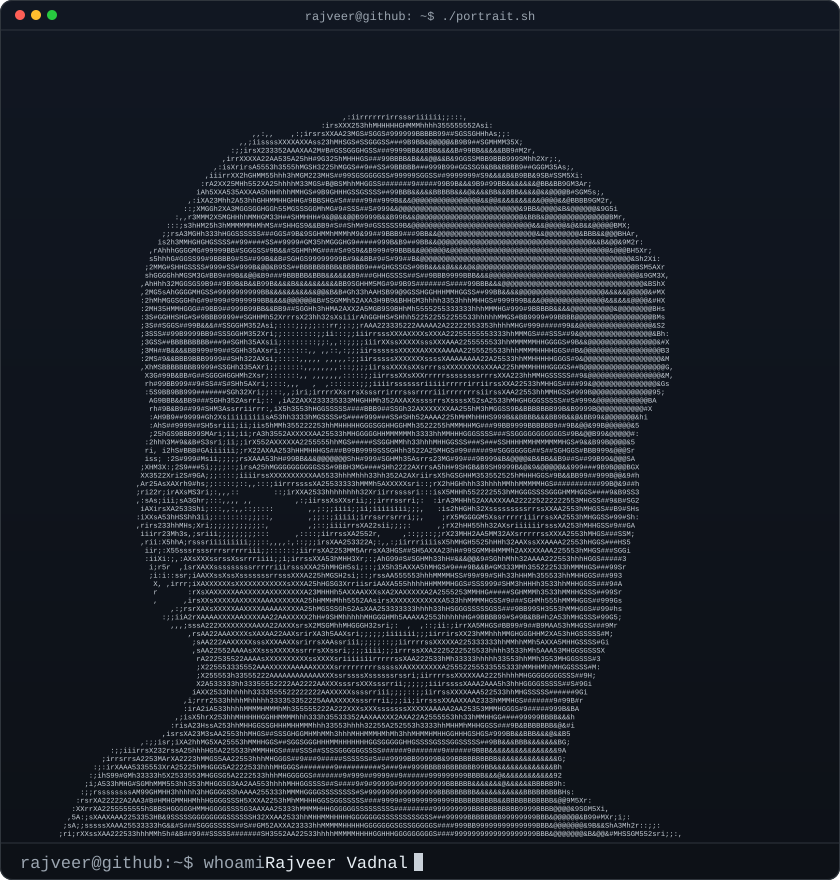
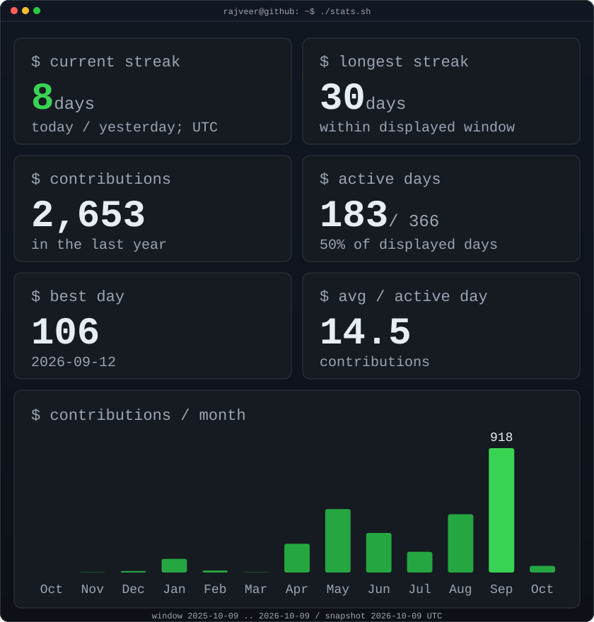

<h3><code>rajveer@github ~ $ ./contributions.sh</code></h3>

<picture>
<source media="(prefers-reduced-motion: reduce) and (prefers-color-scheme: light)" srcset="./assets/contrib-heatmap-static-light.svg" />
<source media="(prefers-reduced-motion: reduce)" srcset="./assets/contrib-heatmap-static.svg" />
<source media="(prefers-color-scheme: light)" srcset="./assets/contrib-heatmap-light.svg" />

</picture>

 
 

<h3><code>rajveer@github ~ $ whoami</code></h3>

<table>
<tr>
<td valign="top"><picture><source media="(prefers-reduced-motion: reduce)" srcset="./assets/rajveer-ascii-static.svg" /></picture></td>
<td valign="top"><picture><source media="(prefers-reduced-motion: reduce)" srcset="./assets/stats-static.svg" /></picture></td>
</tr>
</table>

 
 

<h3><code>rajveer@github ~ $ ./links.sh</code></h3>

<b>Agentic Systems Engineer · Local-first AI · Founder, neuratile</b>

   

 

[Resume](https://rajveer.codes/Rajveer_Vadnal_Resume.pdf) · [Accessible text & evidence](docs/profile-evidence.md) · [Activity snapshot & daily counts](docs/activity.md)

