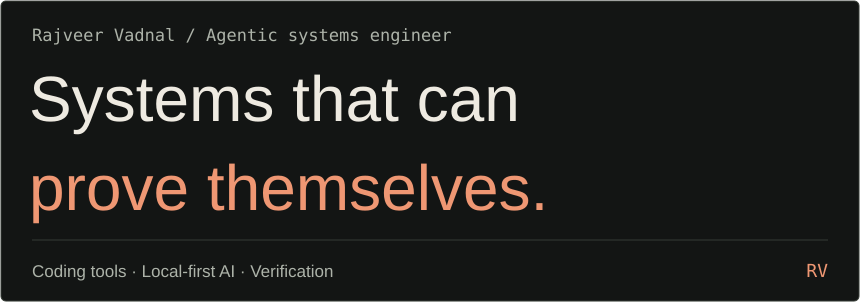
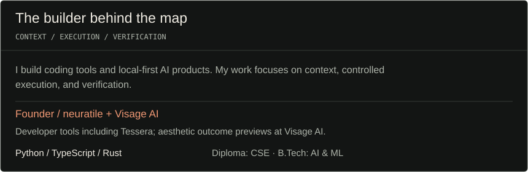
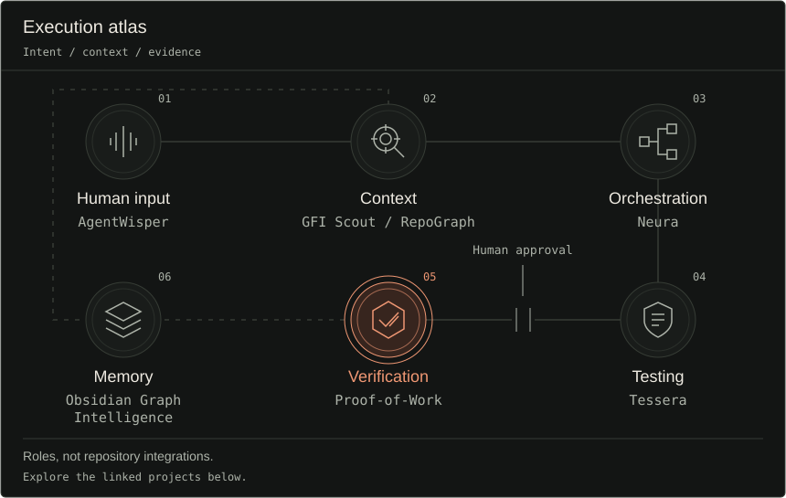
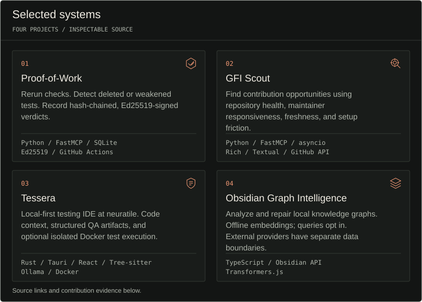
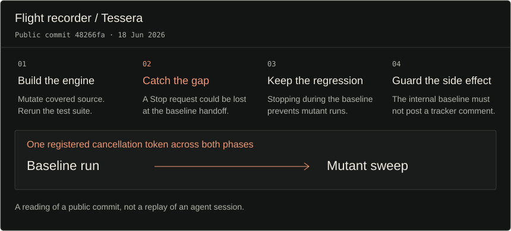
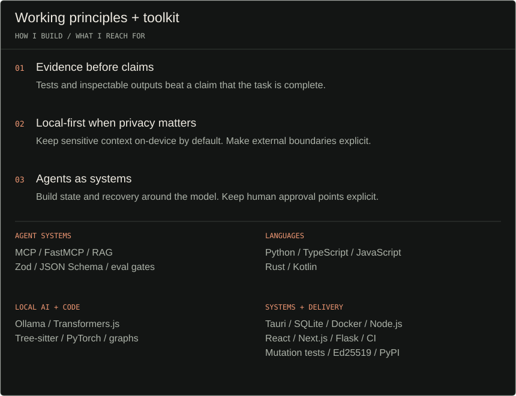
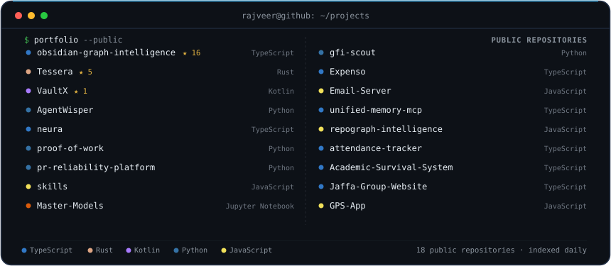
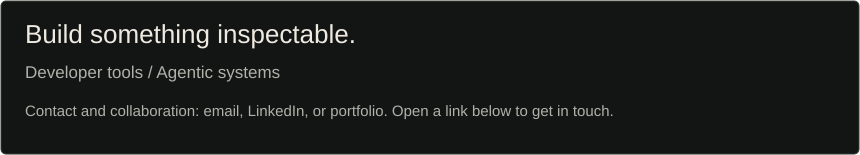

<picture>
  <source media="(max-width: 600px) and (prefers-color-scheme: light)" srcset="assets/profile-header-mobile-light.svg" />
  <source media="(max-width: 600px)" srcset="assets/profile-header-mobile.svg" />
  <source media="(prefers-color-scheme: light)" srcset="assets/profile-header-light.svg" />
  
</picture>

[Portfolio](https://rajveervadnal.netlify.app/) · [Resume](https://rajveervadnal.netlify.app/Rajveer_Vadnal_Resume.pdf) · [LinkedIn](https://www.linkedin.com/in/rajveer-vadnal-374664353) · [Email](mailto:rajveer.r.vadnal@gmail.com) · [Accessible text & evidence](docs/profile-evidence.md)

<picture>
  <source media="(max-width: 600px) and (prefers-color-scheme: light)" srcset="assets/profile-overview-mobile-light.svg" />
  <source media="(max-width: 600px)" srcset="assets/profile-overview-mobile.svg" />
  <source media="(prefers-color-scheme: light)" srcset="assets/profile-overview-light.svg" />
  
</picture>

[neuratile](https://github.com/neuratile) · [Visage AI](https://getvisageai.online/)

<picture>
  <source media="(max-width: 600px) and (prefers-color-scheme: light)" srcset="assets/execution-atlas-mobile-light.svg" />
  <source media="(max-width: 600px)" srcset="assets/execution-atlas-mobile.svg" />
  <source media="(prefers-color-scheme: light)" srcset="assets/execution-atlas-light.svg" />
  
</picture>

[AgentWisper](https://github.com/Rajveerx11/AgentWisper) · [GFI Scout](https://github.com/Rajveerx11/gfi-scout) · [RepoGraph](https://github.com/Rajveerx11/repograph-intelligence) · [Neura](https://github.com/Rajveerx11/neura) · [Tessera](https://github.com/neuratile/Tessera) · [Proof-of-Work](https://github.com/Rajveerx11/proof-of-work)

[Obsidian Graph Intelligence](https://github.com/Rajveerx11/obsidian-graph-intelligence) · [Unified Memory MCP](https://github.com/Rajveerx11/unified-memory-mcp) · [PR Reliability Platform](https://github.com/Rajveerx11/pr-reliability-platform) · [Master Models](https://github.com/Rajveerx11/Master-Models)

<picture>
  <source media="(max-width: 600px) and (prefers-color-scheme: light)" srcset="assets/selected-systems-mobile-light.svg" />
  <source media="(max-width: 600px)" srcset="assets/selected-systems-mobile.svg" />
  <source media="(prefers-color-scheme: light)" srcset="assets/selected-systems-light.svg" />
  
</picture>

[Proof-of-Work / PyPI](https://pypi.org/project/proof-of-work-agent/) · [GFI Scout / Architecture](https://github.com/Rajveerx11/gfi-scout/blob/main/docs/ARCHITECTURE.md) · [Tessera / Website](https://tesseraide.vercel.app/) · [Project details & contributions](docs/profile-evidence.md#selected-systems)

<picture>
  <source media="(max-width: 600px) and (prefers-color-scheme: light)" srcset="assets/flight-recorder-mobile-light.svg" />
  <source media="(max-width: 600px)" srcset="assets/flight-recorder-mobile.svg" />
  <source media="(prefers-color-scheme: light)" srcset="assets/flight-recorder-light.svg" />
  
</picture>

[Pinned commit / 48266fa](https://github.com/neuratile/Tessera/commit/48266fa55f46fff88a966aecf88c0b437e1c5704) · [Correction & regression checks](docs/profile-evidence.md#flight-recorder-a-public-commit-not-a-session-replay)

<picture>
  <source media="(max-width: 600px) and (prefers-color-scheme: light)" srcset="assets/evaluation-mobile-light.svg" />
  <source media="(max-width: 600px)" srcset="assets/evaluation-mobile.svg" />
  <source media="(prefers-color-scheme: light)" srcset="assets/evaluation-light.svg" />
  
</picture>

[Published report](https://github.com/Rajveerx11/proof-of-work/blob/main/reports/2026-08-11-multi-agent/README.md) · [Methodology & limitations](https://github.com/Rajveerx11/proof-of-work/blob/main/reports/2026-08-11-multi-agent/README.md#limitations)

<picture>
  <source media="(max-width: 600px) and (prefers-color-scheme: light)" srcset="assets/working-set-mobile-light.svg" />
  <source media="(max-width: 600px)" srcset="assets/working-set-mobile.svg" />
  <source media="(prefers-color-scheme: light)" srcset="assets/working-set-light.svg" />
  
</picture>

[Full repository index](docs/public-repositories.md) · [Interactive HTML / download and open in a browser](docs/execution-atlas.html)

GitHub activity / dated snapshot

<picture>
  <source media="(max-width: 600px) and (prefers-color-scheme: light)" srcset="assets/contact-mobile-light.svg" />
  <source media="(max-width: 600px)" srcset="assets/contact-mobile.svg" />
  <source media="(prefers-color-scheme: light)" srcset="assets/contact-light.svg" />
  
</picture>

[Email me](mailto:rajveer.r.vadnal@gmail.com) · [Connect on LinkedIn](https://www.linkedin.com/in/rajveer-vadnal-374664353) · [Explore my portfolio](https://rajveervadnal.netlify.app/)
