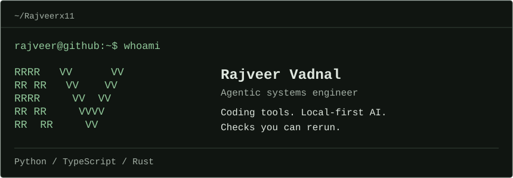
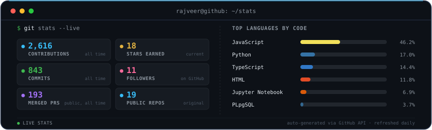

<picture>
  <source media="(max-width: 600px) and (prefers-color-scheme: light)" srcset="assets/terminal-profile-mobile-light.svg" />
  <source media="(max-width: 600px)" srcset="assets/terminal-profile-mobile.svg" />
  <source media="(prefers-color-scheme: light)" srcset="assets/terminal-profile-light.svg" />
  
</picture>

[Portfolio](https://rajveer.codes/) / [Resume](https://rajveer.codes/Rajveer_Vadnal_Resume.pdf) / [LinkedIn](https://www.linkedin.com/in/rajveer-vadnal-374664353) / [Email](mailto:rajveer.r.vadnal@gmail.com)

I spend most of my time in terminals. I build coding tools and local-first AI products around **context, controlled execution, and verification**. Founder at [neuratile](https://neuratile.rajveer.codes/) and [Visage AI](https://getvisageai.online/).

[Accessible text & evidence](docs/profile-evidence.md)

### `~$ ls projects/`

**[proof-of-work/](https://github.com/Rajveerx11/proof-of-work)**: Verification for coding-agent work. Rerun checks, detect weakened tests, and record signed verdicts.<br />
`Python / FastMCP / SQLite / Ed25519`<br />
[PyPI](https://pypi.org/project/proof-of-work-agent/) / [Evaluation & limitations](https://github.com/Rajveerx11/proof-of-work/blob/main/reports/2026-08-11-multi-agent/README.md)

**[gfi-scout/](https://github.com/Rajveerx11/gfi-scout)**: Find open-source contribution opportunities using repository health, issue freshness, and setup friction. MCP tools and a CLI/TUI.<br />
`Python / FastMCP / Rich / Textual`<br />
[Architecture](https://github.com/Rajveerx11/gfi-scout/blob/main/docs/ARCHITECTURE.md)

**[neuratile/Tessera/](https://github.com/neuratile/Tessera)**: Local-first testing IDE. Code context, structured QA artifacts, and optional isolated Docker execution. Built at neuratile.<br />
`Rust / Tauri / React / Ollama / Docker`<br />
[Website](https://tesseraide.vercel.app/) / [My contributions](docs/profile-evidence.md#tessera)

**[neura/](https://github.com/Rajveerx11/neura)**: Windows-first engineering-agent harness for Pi. Explicit modes, policy guardrails, recovery, and verification.<br />
[Source & documentation](https://github.com/Rajveerx11/neura)

[Browse the public repository index →](docs/public-repositories.md)

### `~$ cat activity.snapshot`

<picture>
  <source media="(max-width: 600px) and (prefers-color-scheme: light)" srcset="assets/contrib-heatmap-mobile-light.svg" />
  <source media="(max-width: 600px)" srcset="assets/contrib-heatmap-mobile.svg" />
  <source media="(prefers-color-scheme: light)" srcset="assets/contrib-heatmap-light.svg" />
  
</picture>

<picture>
  <source media="(max-width: 600px) and (prefers-color-scheme: light)" srcset="assets/github-stats-mobile-light.svg" />
  <source media="(max-width: 600px)" srcset="assets/github-stats-mobile.svg" />
  <source media="(prefers-color-scheme: light)" srcset="assets/github-stats-light.svg" />
  
</picture>

[Activity snapshot & daily counts (text)](docs/activity.md) / [Counting rules](docs/profile-evidence.md#public-catalog-and-activity)

### `~$ cat principles.txt`

```text
evidence:  rerunnable checks
privacy:   explicit boundaries
execution: recovery + approval
```

<details>
<summary><code>~$ find ./</code>: more work & evidence</summary>

<br />

- **Context:** [RepoGraph Intelligence](https://github.com/Rajveerx11/repograph-intelligence)
- **Memory:** [Obsidian Graph Intelligence](https://github.com/Rajveerx11/obsidian-graph-intelligence) · [Unified Memory MCP](https://github.com/Rajveerx11/unified-memory-mcp)
- **Human input:** [AgentWisper](https://github.com/Rajveerx11/AgentWisper)
- **Review:** [PR Reliability Platform](https://github.com/Rajveerx11/pr-reliability-platform)
- **Local models:** [Master Models](https://github.com/Rajveerx11/Master-Models)

[Project details, attribution & evaluation](docs/profile-evidence.md) / [Public repository index](docs/public-repositories.md) / [Execution atlas / download and open locally](docs/execution-atlas.html)

The atlas groups projects by role; it does not claim implemented integrations. Published evaluations retain their methodology and limitations.

</details>

### `~$ ./connect`

Building developer tools or local-first AI? [Email me](mailto:rajveer.r.vadnal@gmail.com) or [connect on LinkedIn](https://www.linkedin.com/in/rajveer-vadnal-374664353).
